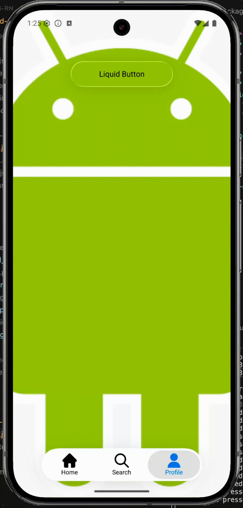

# expo-liquid-glass-native

Expo module for LiquidGlass native Android components with beautiful glassmorphism effects.

> **Note:** This library is an Expo adaptation of [AndroidLiquidGlass](https://github.com/Kyant0/AndroidLiquidGlass) by Kyant0. It provides native Android components with liquid glass effects for React Native/Expo applications. iOS support is planned for future releases.

## Demo

<div align="center">
  
</div>

## Installation

### Step 1: Install the package

```bash
npm install expo-liquid-glass-native
```

or

```bash
yarn add expo-liquid-glass-native
```

### Step 2: Add plugin to `app.json`

Add the plugin to your `app.json` (or `app.config.js`):

```json
{
  "expo": {
    "plugins": [
      "expo-liquid-glass-native"
    ]
  }
}
```

### Step 3: Prebuild native code

Run prebuild to generate native code with the plugin applied:

```bash
npx expo prebuild --clean
```

**Note:** If you're using Expo Development Build, the prebuild will happen automatically when you run:

```bash
npx expo run:android
```

That's it! The config plugin will automatically:
- ✅ Add Compose plugin to `settings.gradle`
- ✅ Add Compose dependencies to `app/build.gradle`
- ✅ Register ViewManagers in `MainApplication.kt`

No manual native code configuration needed! 🎉

## Usage

### LiquidButton

#### Basic Usage

```tsx
import { LiquidButtonView } from 'expo-liquid-glass-native';

function MyComponent() {
  return (
    <LiquidButtonView
      title="Button"
      enabled={true}
      tint="#0088FF"
      surfaceColor="#FFFFFF4D"
      blurRadius={2}
      onPress={() => {
        console.log('Button pressed!');
      }}
      style={{ width: 200, height: 50 }}
    />
  );
}
```

#### With Realtime Background Capture

The `useRealtimeCapture` prop allows the button to capture the screen content behind it in real-time, creating a beautiful glassmorphism effect that reflects the actual background:

```tsx
import { LiquidButtonView } from 'expo-liquid-glass-native';
import { ScrollView, ImageBackground } from 'react-native';

function MyComponent() {
  return (
    <ScrollView>
      <ImageBackground source={require('./assets/wallpaper.jpg')}>
        <LiquidButtonView
          title="Glass Button"
          enabled={true}
          useRealtimeCapture={true}
          tint="transparent"
          surfaceColor="#00FFFFFF"
          blurRadius={2}
          onPress={() => {
            console.log('Button pressed!');
          }}
          style={{ width: 200, height: 50 }}
        />
      </ImageBackground>
    </ScrollView>
  );
}
```

**Props:**
- `title?: string` - Button text
- `enabled?: boolean` - Whether the button is enabled (default: true)
- `tint?: string` - Tint color in hex format (e.g., "#0088FF" or "transparent")
- `surfaceColor?: string` - Surface color in hex format with alpha (e.g., "#FFFFFF4D" or "#00FFFFFF" for transparent)
- `blurRadius?: number` - Blur radius in dp (default: 2)
- `lensX?: number` - Lens X radius in dp (default: 12)
- `lensY?: number` - Lens Y radius in dp (default: 24)
- `imageUri?: string` - URI of the background image (deprecated, use `backgroundImageUri` instead)
- `backgroundImageUri?: string` - URI of the background image for this specific button
- `useRealtimeCapture?: boolean` - Use realtime screen capture instead of image. Captures the entire screen behind the button (default: false)
- `renderBackgroundContent?: boolean` - Render background content in Compose (default: false)
- `onPress?: (event: { nativeEvent: {} }) => void` - Press event handler
- `style?: ViewStyle` - Style object

**Note:** When `useRealtimeCapture` is enabled, the button captures the entire screen (DecorView) behind it, making it perfect for use with ScrollViews and other scrollable containers. The capture happens at 60fps for smooth animations.

### BottomTabs

```tsx
import { BottomTabsContentView } from 'expo-liquid-glass-native';
import { Image } from 'react-native';
import { useState, useMemo } from 'react';

function MyTabs() {
  const [selectedTab, setSelectedTab] = useState(0);
  
  // Convert require() images to URIs
  const tabIcons = useMemo(() => {
    const icons = [
      require('./assets/home.png'),
      require('./assets/search.png'),
      require('./assets/profile.png'),
    ];
    
    return icons.map(icon => {
      try {
        const source = Image.resolveAssetSource(icon);
        return source?.uri || null;
      } catch (e) {
        console.warn('Failed to resolve asset source:', e);
        return null;
      }
    }).filter(Boolean);
  }, []);
  
  return (
    <BottomTabsContentView
      selectedTabIndex={selectedTab}
      tabsCount={3}
      tabLabels={['Home', 'Search', 'Profile']}
      tabIcons={tabIcons}
      iconTintEnabled={true}
      onTabSelected={(event) => {
        setSelectedTab(event.nativeEvent.index);
        console.log('Tab selected:', event.nativeEvent.index);
      }}
      style={{ flex: 1 }}
    />
  );
}
```

**Props:**
- `selectedTabIndex?: number` - Currently selected tab index (default: 0)
- `tabsCount?: number` - Number of tabs (default: 3)
- `tabLabels?: string[]` - Array of tab labels
- `tabIcons?: string[]` - Array of icon URIs (use `Image.resolveAssetSource()` to convert require() images to URIs)
- `iconTintEnabled?: boolean` - Whether to apply content color tint to icons (default: true)
- `onTabSelected?: (event: { nativeEvent: { index: number } }) => void` - Tab selection handler
- `style?: ViewStyle` - Style object

**Note:** `tabIcons` should be an array of URI strings. Use `Image.resolveAssetSource()` to convert `require()` images to URIs.

## Features

- ✨ **Beautiful Glassmorphism Effects** - Native Android components with liquid glass effects
- 🎨 **Realtime Background Capture** - Capture screen content behind buttons in real-time (60fps)
- 📱 **ScrollView Compatible** - Works seamlessly with ScrollViews and other scrollable containers
- 🎯 **Customizable** - Adjust blur radius, lens size, colors, and more
- 🚀 **Performance Optimized** - Hardware-accelerated rendering with efficient caching

## Requirements

- **Android**: minSdkVersion 24
- **iOS**: Not yet implemented (PRs welcome!)
- **Expo SDK**: 54+

## Examples

Check out the [example](./example) directory for complete usage examples, including:
- Basic button usage
- Buttons with realtime background capture
- Bottom tabs navigation
- ScrollView integration

## Performance Tips

1. **Realtime Capture**: Use `useRealtimeCapture` sparingly as it captures the screen at 60fps. Consider using static `backgroundImageUri` when possible.
2. **Blur Radius**: Lower blur radius values (1-3) perform better than higher values.
3. **Caching**: The library automatically caches captured bitmaps for better performance.

## Known Limitations

- iOS support is planned for future releases
- Realtime capture may have slight performance impact on lower-end devices
- Some complex view hierarchies may not capture correctly

## License

See [LICENSE.txt](LICENSE.txt) for details.

## Contributing

PRs are welcome! Please open an issue first to discuss major changes before submitting a pull request.
